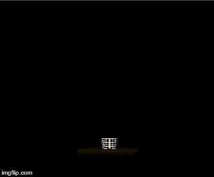
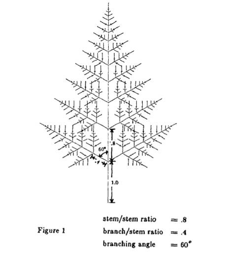

# Real time design of fractal trees using Oppenheimer algorithm

Implementation of the algorithm presented in New York Institute of Technology Peter E. Oppenheimer [publication](https://dl.acm.org/citation.cfm?id=15892 "Real Time Design and Animation of Fractal Plants and Trees").

## Idea

  

> Benoit Mandelbrot recognized that the relationship between large scale structure and small scale detail is an important aspect of natural phenomena. He gave the name fractala to objects that exhibit increasing detail as one zooms in closer. If the small scale detail resembles the large scale detail, the object is said to be self-similar.

> The geometric notion of fractal self-similarity has become a paradigm for structure in the natural world. Nowhere is this principle more evident than in the world of botany. Recursive branching at many levels of scale, is a primary mechanism of growth in most plants. Analogously, recursive branching algorithms, are furdamental to computers. Many high performance processing engines specialize in tree data structures.

The tree model implemented here has the following features:
* Recursive tree model
* Manual reseeding the random number generator
* Real time design
* Stochastic modelling of tree bark along with topological and geometric parameters
* High resolution renderings
* A detailed parametrization of the geometric relationship between tree nodes

## Getting Started

You need Windows, GLUT library, Visual Studio 2005 or newer, and a little bit of patience. It should work on other systems as well, but you might need to adapt the source code.

  

## Authors

* Karol Bonenberg

## License

This project is licensed under the GNU GPL Version 3 - see the [LICENSE.md](LICENSE.md) file for details

## Acknowledgments

* Real Time Design and Animation of Fractal Plants and Trees; Peter E. Oppenheimer
* Developmental Models of Herbaceous Plants for Computer Imagery Purposes; Przemysław Prusinkiewicz, Arstid Lindenmayer, James Hanan
* Structural simulation of tree growth and response; John C. Hart, Brent Baker, Jeyprakash Michaelraj
